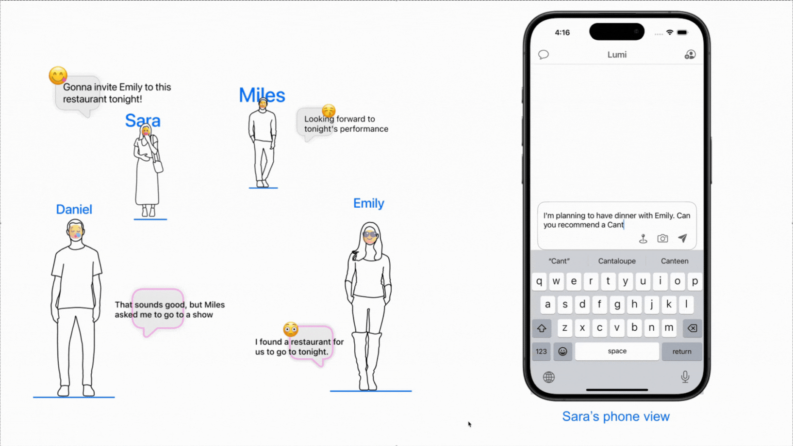
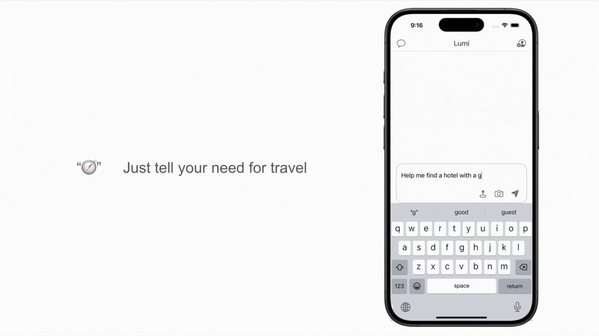

## TODO – content coming

## Background

### Inspiration  
Planning a seven-day trip to Japan with four friends sounded exciting—until our group chat was flooded with ramen spots, “must-see” shrines, and rail-pass links that vanished under newer messages. On the road, some of us lingered for photos while others urged us to hurry; the “temporary leader” juggled maps, time, and moods.  
That chaos sparked the idea for **Lumi**: an AI guide who knows everyone’s location, preferences, and pace, proactively sends meet-up reminders, navigation tips, and even mood buffers, so humans can focus on the journey—not the coordination.  

### User Research  
**93 survey responses** and **5 in-depth group interviews** distilled five recurring pain-points in group travel:  

1. **Route-planning conflict** — opinions diverge early and are hard to merge.  
2. **High real-time comms cost** — key info is buried across chat apps.  
3. **Complex on-the-fly changes** — re-booking tickets, maps, and schedules is tedious.  
4. **Preference clashes** — walking distance, diets, budgets spark friction.  
5. **Info mis-alignment** — not everyone gets the latest meet-up or route change.  

Lumi is designed to tackle these five issues with real-time decision brokering, synced information, and dramatically lower communication burden.

- Different backgrounds  
- Different habits  
- Conflicts and disagreements  

### Anachronistic Brainstorming  
Travel is ultimately about *relaxation and self-expression*—each member wants to explore at their own rhythm. When strong self-interests collide without a consensus-building mechanism, minor differences balloon into frustration.  
A great tour guide’s hidden super-power is to **form a “temporary consensus”** and keep mediating along the way—introducing a baseline everyone can accept, then converging opinions whenever new conflicts emerge, so the group pace stays smooth and pleasant.

## Product Design  

### Core Functions  

- **Communication Management**  
  Lumi uses quick polls + AI suggestions to craft compromises the moment opinions diverge, then auto-pushes meet-ups, late-comer nudges, and re-routing—consensus with minimum chatter.  

- **Proactive Service**  
  Using live location, weather, and queue times, Lumi reshuffles the schedule, offers fallback routes, and chains hotel check-in or ticket scans into one-tap workflows—off-loading decisions and app-hopping to AI.  

- **Information Sharing**  
  Meet-up times, traffic updates, and personal routes are broadcast in one unified feed + multi-user map; every edit is versioned, so the team always sees **one latest, single source of truth**.  

### Communication Management  

- **Private assistant chat.** A member can DM Lumi for routes, transfers, or dining tips. The message hits the *Prompt Manager*, is merged with system guide prompts, sent to the LLM, and the reply returns as Lumi’s voice—personal guidance without spamming the team.  
- **Broadcast via Lumi.** Need to alert teammates? Just type “@Lumi tell…”. The original text + directive template goes to the LLM, which produces a formatted, translated notice in Lumi’s tone. Lumi then broadcasts it; receivers see the message *from* the guide, keeping language and tone consistent and reducing miscommunication.

### Information Sharing  

On the **Travel Page**, Lumi merges team locations and agenda into one shared map with three live cards: **Information Broadcast** pushes pop-ups at breakfast, meet-ups, etc., showing who’s where and ETA; **Traffic Information** updates routes and times when congestion hits; **Navigation & Schedule** summarises the next stop in natural language and gathers feedback, then optimises the plan for everyone. This layered flow keeps the whole group in sync and slashes coordination overhead.

### Proactive Service — LLM × GIS  

Lumi’s GIS stack links **GPT-4o**, **Apple MapKit**, and **iOS Shortcuts** into a “Understand → Plan → Execute → Feedback” loop. Free-form requests like  
> “How long to walk from Columbia to MoMA?”  
are wrapped in a four-part prompt (system rules, context, tool schema, user message). The tool schema exposes JSON functions such as `findRoute(destination, mode)`.  
GPT-4o returns a function call `{ "name":"findRoute", … }`. Router hands it to **MapManager**, which queries MapKit for ETA and polyline, generates a snapshot, then feeds the JSON back for GPT-4o to craft human-readable cards.  
Tapping **Navigate** writes the same coordinates into an *App Intent*, jumping straight to Apple Maps or CarPlay. Future “Navigate to MoMA” via Siri reuses the cached intent, bypassing the LLM. Combine streams decouple layers; a JSON schema glues them together—LLM handles language, MapKit handles geometry, and Shortcuts trigger OS-level actions.

- **Scenario 1:** Lumi builds a week-long itinerary table from live map data.

- **Scenario 2:** Lumi quickly filters quality breakfast hotels near the destination.

- **Scenario 3:** Lumi generates a 3-hour city stroll plan within 3 km of the current location.

  

